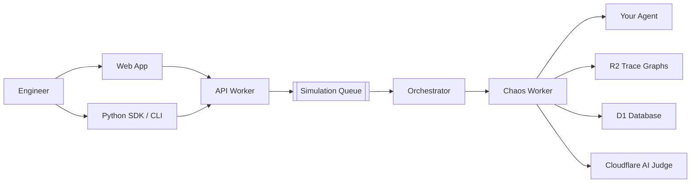

# WatchLLM

**Agent reliability platform for AI engineering teams.**

Stress-test your agents with real adversarial scenarios, capture every execution as a replayable trace graph, and debug + harden them with fork-based workflows.

Traditional observability shows you what happened.  
**WatchLLM shows you how your agent fails under pressure — and lets you fix it.**

[→ Try it live](https://watchllm.dev) • [Docs](https://docs.watchllm.dev) • [Dashboard](https://app.watchllm.dev)

## Why WatchLLM

- Run targeted chaos simulations across 8 high-risk attack categories
- Get automatic severity scoring (rule-based + LLM judge)
- Store full execution traces as replayable graphs in R2
- Fork from any failure point and re-run with fixes instantly

Built for speed: from zero to hardened agent in minutes, not days.

## Platform At A Glance

| Surface          | Runtime                  | Responsibility                          |
|------------------|--------------------------|-----------------------------------------|
| **Web**          | Next.js App Router       | UI, projects, agents, simulations, billing |
| **API**          | Cloudflare Workers + Hono| Auth, CRUD, simulation orchestration    |
| **Orchestrator** | Cloudflare Queue         | Fans out chaos runs                     |
| **Chaos Engine** | Cloudflare Workers       | Executes attacks, scores severity, writes traces |
| **Storage**      | D1 + R2 + KV             | System of record + trace graphs         |

## Core Capabilities

### Attack Categories
- `prompt_injection`
- `tool_abuse`
- `hallucination`
- `context_poisoning`
- `infinite_loop`
- `jailbreak`
- `data_exfiltration`
- `role_confusion`

### Severity Scoring
```math
severity = max(rule\_score, judge\_score)
```
- Fast rule-based scorer first
- LLM judge only when needed
- Compromised = severity ≥ 0.7

### Pricing Tiers

| Tier   | Simulations/mo | History   | Replay & Fork | Team Seats |
|--------|----------------|-----------|---------------|------------|
| **Free**   | 5              | 7 days    | No            | 1          |
| **Pro**    | 100            | 90 days   | Yes           | 1          |
| **Team**   | 500            | 365 days  | Yes           | 10         |

## Quick Start (Python SDK)

```python
import watchllm

@watchllm.test(
    categories=["prompt_injection", "hallucination"],
    threshold="severity < 0.3",
    wait=True
)
def my_agent(prompt: str) -> str:
    return f"Echo: {prompt}"

my_agent("hello world")
```

**CLI examples:**
```bash
watchllm auth login
watchllm simulate --agent mymodule.my_agent --categories prompt_injection,hallucination
watchllm replay --simulation sim_abc123
```

## System Architecture



Full simulation lifecycle, data model, and API reference → [docs.watchllm.dev](https://docs.watchllm.dev)

## Monorepo Layout

```text
watchllm/
├── apps/
│   ├── web/                 # Next.js dashboard
│   └── workers/
│       ├── api/             # Hono API
│       ├── orchestrator/    # Queue consumer
│       └── chaos/           # Attack execution engine
├── packages/
│   ├── types/               # Shared TypeScript types
│   └── sdk-python/          # Official Python SDK + CLI
├── migrations/              # D1 schema
```

## Local Development

```bash
npm install
npm run migrate          # local D1
npm run dev:api
npm run dev --workspace=apps/workers/orchestrator
npm run dev --workspace=apps/workers/chaos
```

**Stack**: Next.js • Cloudflare Workers • D1 • R2 • KV • Hono • Better Auth • Stripe + Razorpay

---

**Internal project.** Not open source yet (SDKs are public).  
Built with ❤️ for the global AI agent ecosystem.
